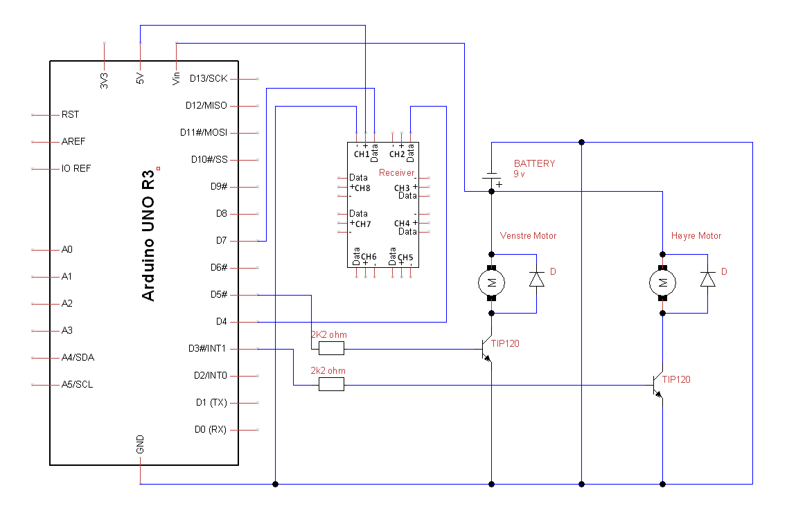
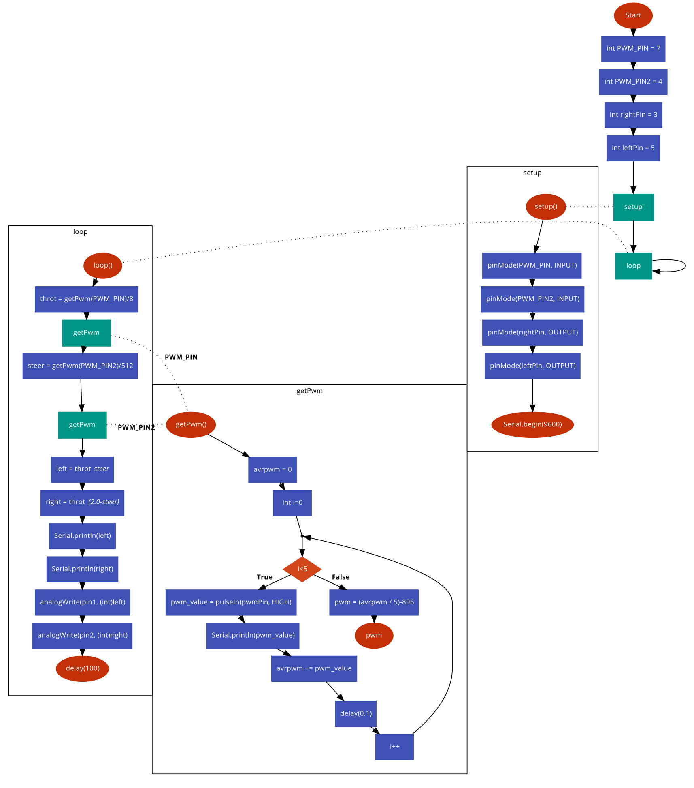

# Fjernstyrt bil


Det neste prosjektet vi lagde var en fjernstyrt bil. Vi brukte en sender og mottaker lagd for droner. Mottakeren har 8 kanaler som sender ut PWM signaler. Hver kanal har + og - koblinger, men man trenger bare koble inn 5 volt på en av kanalene. Vi trengte også bare 2 kanaler: en til gass og en til styring. Arduinoen tar imot disse signalene og gjør de om til verdier for høyre og venstre hjul på bilen. Her brukes transistorer for å styre motorene.





\pagebreak


### Arduino kode

Programmet starter med å definere pins for pwm inputs og høyre og venstre hjul output pins. Etter dette kommer en funksjon for å lese en pwm puls. Den bruker pulseIn() for å lese lengden på en Høy puls. Vi sjekker denne 5 ganger og tar gjennomsnittet, for å få en mer stabil verdi. Vi trekker så fra 896 for å 0 verdien fra senderen til å være i arduinoen.

I `setup()` setter vi PWM pinsene til inputs og høyre og venstre hjul pinsene til outputs. Vi starter også seriekommunikasjon til pcen.

I `loop()` bruker vi `getPwm()` funksjonen vi lagde til å trekke ut pwm signalet for begge kanalene. for den første deler vi på 8 for at verdien skal være innenfor 128 verdier, som er halvparten av det som kan sendes med `analogWrite()`. Den andre kanalen deler vi på 512 for å få verdien innenfor 2. Denne verdien velger hvor mye bilen svinger. left blir throttle ganget med styringen og right blir throttle ganger med omvendtproposjonale av steer. Det gjør at hvis steer er 1, vil bilen gå rett fram, hvis steer er mindre enn 1 vil den gå mot venstre og større enn 1 vil den gå mot høyre. Vi sender høyre og venstre verdiene over serieporten så de kan sees på pcen. Til slutt sendes verdiene ut til leftpin og rightpin.

```cpp
// Definerer input pinsene for pwm signalet fra receiveren
int PWM_PIN = 7;
int PWM_PIN2 = 4;

// Definerer pinsene for høyre og venstre hjul
int rightPin = 3;
int leftPin = 5;


// Funksjon for å få ut gjennomsnitlig pwm signal over 5 perioder
float getPwm(int pwmPin){
	float avrpwm = 0; // Setter gjennomsnitlig pwm til 0
	for(int i=0; i<5; i++){ // Kjører 5 ganger
		// setter pwm_value til lengden på en høy puls i ms.
		float pwm_value = pulseIn(pwmPin, HIGH);
		avrpwm += pwm_value; // plusser på pwm_value til avrpwm
		delay(0.1); //veldig kort pause for å unngå error
	}
	//trekker fra 896 for at 0 throttle på kontrolleren skal ha verdi 0
	float pwm = (avrpwm / 5)-896;
	return pwm;
}

void setup() {
	// Setter PWM pinsene til input og rightpin og leftpin til output
	pinMode(PWM_PIN, INPUT);
	pinMode(PWM_PIN2, INPUT);
	pinMode(rightPin, OUTPUT);
	pinMode(leftPin, OUTPUT);
	// Starter seriekommunikasjon til pcen, med overføringshastiget på 9600
	Serial.begin(9600);
}

void loop() {
	//leser pwm fra throttle pinnen. deler på 8 for å få resultater
	//innenfor 128 verdier
	float throt = getPwm(PWM_PIN)/8;
	//deler på 512 for at verdien skal gå fra 0 til 2.
	//Den funker som en multiplier
	float steer = getPwm(PWM_PIN2)/512;

	// ganger throttle med steer.
	//når steer er 1 vil begge hjul gå like fort.
	float left = throt * steer;
	// steer fungere omvendt proposjonal på høyre hjul,
	// i forhold til venstre hjul
	float right = throt * (2.0-steer);

	// Sender verdiene for høyre og venstre hjul over serie,
	//så det kan sees på pc
	Serial.println(left);
	Serial.println(right);

	// Skriver pwm verdien for høyre og venstre hjul til utgangene.
	analogWrite(leftPin, (int)left);
	analogWrite(rightPin, (int)right);
	// venter i 100 ms
	delay(100);
}
```
